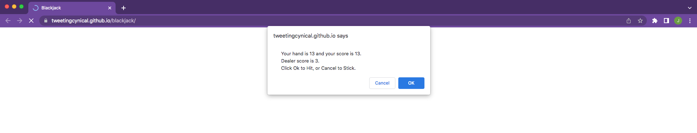

# Blackjack

## A simple game, interacting with the user via alerts

### Deployment / Code Repository

[Live deployment](https://tweetingcynical.github.io/blackjack/)

[Repository](https://github.com/TweetingCynical/blackjack)

### Scope and Purpose

Build a console game which pits the user against the CPU, for the traditional, best to 21 format.

### Pseudocode

Steps to achieving the working game:

* Declare variables needed for the game:
  - Initial array for dealer with random number between 2 and 11 for first card;
  - Initial array for user with random number between 4 and 21 for first card;
  - Set userScore and dealerScore to the index[0] stored in initial userHand and dealerHand respectively;
  - Set blackjack score to 21;
* Create function to handle producing a random number between two ints x and y inclusive;
* Ask user if they want to play;
  - If player choose yes && their score is already blackjack, display 'win' message;
  - Else enter userLoop to play under conditions for user;
* Create function to handle dealing a new card, no matter which player it is for (updating the correct player's array and score accordingly);
* Function for userLoop to manage whether to: 
  - hit => dealNew; (repeat while hit is true && not bust);
  - stick => revert to dealerLoop;
  - bust => game over message;
* Function for dealerLoop to manage whether to:
  - hit is true if dealerScore is less than 17 && less than userScore (repeat while hit is true && not bust);
  - stick if dealerScore is between 17 and 21 inclusive => revert to compareScores;
  - bust if dealerScore > 21;
* Function to manage comparing scores:
  - Compare each to blackjack target (21);
  - If user is closer, they win;
  - If dealer is closer, they win;
  - If userScore === dealerScore, draw;

### Overview of Build

Some of the key JavaScript skills being utilised:
- Use of an array to store the hand history;
- Use of functions to store steps in code;
- Use of single and multiple arguments passed through function to limit amount of code used to update scores and arrays;

    function dealNew(arr, whoScore) {
      randNew = randHand(2,11)
      addNew = arr.push(randNew);
      whoScore += randNew;
      return whoScore;
    }

- Use of Math.floor() and Maths.random() to generate random whole numbers:
    
    function randHand(x,y) {
      return Math.floor(Math.random() * (y - x + 1)) + x;
    }

- While loop to continue game play under certain conditions:
- Use of conditionals to check for revert to next function state;
- Use of conditionals to check for user win state;

## Suggested future changes

- Add images and score board to html so that game becomes based in browser and not through console;
- Add a play again option for user to play a  game from the start (possibly keeping a running total of all wins). This would involve resetting the stored arrays and running scores;

## Screenshot

Working version of site should look like this at standard screen size:

## License

MIT License

Copyright (c) 2022 TweetingCynical

Permission is hereby granted, free of charge, to any person obtaining a copy of this software and associated documentation files (the "Software"), to deal in the Software without restriction, including without limitation the rights to use, copy, modify, merge, publish, distribute, sublicense, and/or sell copies of the Software, and to permit persons to whom the Software is furnished to do so, subject to the following conditions:

The above copyright notice and this permission notice shall be included in all copies or substantial portions of the Software.

THE SOFTWARE IS PROVIDED "AS IS", WITHOUT WARRANTY OF ANY KIND, EXPRESS OR IMPLIED, INCLUDING BUT NOT LIMITED TO THE WARRANTIES OF MERCHANTABILITY, FITNESS FOR A PARTICULAR PURPOSE AND NONINFRINGEMENT. IN NO EVENT SHALL THE AUTHORS OR COPYRIGHT HOLDERS BE LIABLE FOR ANY CLAIM, DAMAGES OR OTHER LIABILITY, WHETHER IN AN ACTION OF CONTRACT, TORT OR OTHERWISE, ARISING FROM, OUT OF OR IN CONNECTION WITH THE SOFTWARE OR THE USE OR OTHER DEALINGS IN THE SOFTWARE.